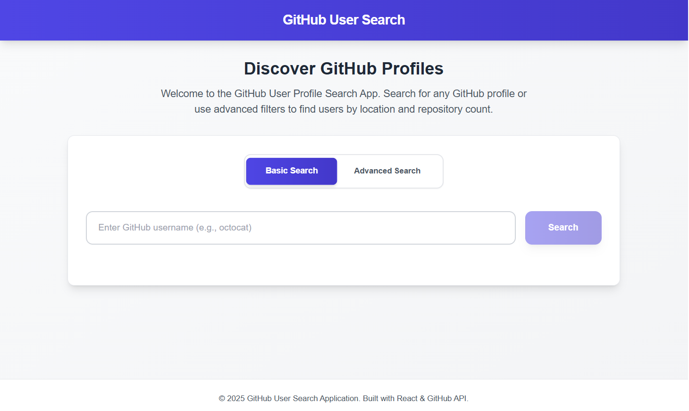

# GitHub User Search Application

A modern, responsive web application that allows users to search for GitHub profiles using the GitHub API. Built with React and Tailwind CSS, this application features both basic and advanced search capabilities with a beautiful, intuitive user interface.



## Live Demo

**[View Live Application](https://mygithub-search.vercel.app/)**

The application is deployed and running on Vercel.

## Features

- **Basic Search**: Search for GitHub users by their username
- **Advanced Search**: Filter users by:
  - Username
  - Location
  - Minimum number of repositories
- **Detailed User Profiles**: View comprehensive user information including:
  - Avatar and bio
  - Location
  - Repository count
  - Follower and following counts
  - Direct link to GitHub profile
- **Pagination**: Load more results for advanced searches
- **Responsive Design**: Fully optimized for desktop, tablet, and mobile devices
- **Modern UI**: Enhanced with gradients, shadows, and smooth transitions

## Technologies Used

- **React 18** - Frontend framework
- **Vite** - Build tool and development server
- **Tailwind CSS v3** - Utility-first CSS framework
- **GitHub REST API** - Data source for user information
- **JavaScript (ES6+)** - Programming language

## Prerequisites

Before you begin, ensure you have the following installed:

- Node.js (v14.0.0 or higher)
- npm or yarn package manager
- Git

## Getting Started

### 1. Clone the Repository

```bash
git clone https://github.com/abul-firdaws/github-user-search.git
cd github-user-search
```

### 2. Install Dependencies

```bash
npm install
```

### 3. Run the Development Server

```bash
npm run dev
```

The application will be available available at `http://localhost:5173`

### 4. Build for Production

```bash
npm run build
```

### 5. Preview Production Build

```bash
npm run preview
```

## Project Structure
```
github-user-search/
├── src/
│   ├── components/
│   │   └── Search.jsx          
│   ├── services/
│   │   └── githubService.js    
│   ├── App.jsx                 
│   ├── App.css                 
│   ├── index.css               
│   └── main.jsx                
├── public/                     
├── index.html                  
├── package.json                
├── tailwind.config.js          
├── postcss.config.js           
└── vite.config.js            
```

## Usage

### Basic Search

1. Click on the "Basic Search" tab
2. Enter a GitHub username (e.g., "abul-firdaws")
3. Click "Search" or press Enter
4. View the user's profile information

### Advanced Search

1. Click on the "Advanced Search" tab
2. Fill in one or more search criteria:
   - Username
   - Location (e.g., "San Damongo")
   - Minimum number of repositories (e.g., "10")
3. Click "Advanced Search"
4. Browse through the results
5. Click "Load More Results" to see additional users

## API Integration

This application uses the GitHub REST API v3:

- **User Search Endpoint**: `https://api.github.com/users/{username}`
- **Advanced Search Endpoint**: `https://api.github.com/search/users?q={query}`

**Note**: GitHub API has rate limits:

- Unauthenticated requests: 60 requests per hour
- Authenticated requests: 5,000 requests per hour

To increase your rate limit, consider adding a GitHub personal access token.

## Styling

The application uses Tailwind CSS with custom configurations:

- **Color Scheme**: Indigo and blue gradients
- **Typography**: System fonts with careful hierarchy
- **Components**: Custom-styled cards, buttons, and forms
- **Animations**: Smooth transitions and hover effects
- **Responsive**: Mobile-first design approach

## Deployment

### Deploy to Vercel

1. Push your code to GitHub
2. Visit [vercel.com](https://vercel.com)
3. Import your repository
4. Vercel will auto-detect the configuration
5. Click "Deploy"

### Deploy to Netlify

1. Push your code to GitHub
2. Visit [netlify.com](https://netlify.com)
3. Click "New site from Git"
4. Select your repository
5. Build command: `npm run build`
6. Publish directory: `dist`
7. Click "Deploy site"

## Environment Variables (Optional)

To use GitHub authentication and increase API rate limits:

Create a `.env` file in the root directory:

```env
VITE_GITHUB_TOKEN=your_github_personal_access_token
```

Update `githubService.js` to include the token in API requests.

## Troubleshooting

### Tailwind CSS not working

```bash
npm uninstall tailwindcss
npm install -D tailwindcss@3 postcss autoprefixer
npx tailwindcss init -p
```

### API Rate Limit Exceeded

- Wait for the rate limit to reset (check response headers)
- Consider adding a GitHub personal access token
- Implement caching for frequently searched users

## Contributing

Contributions are welcome! Please feel free to submit a Pull Request.

1. Fork the repository
2. Create your feature branch
3. Commit your changes
4. Push to the branch
5. Open a Pull Request

## License

This project is part of my learning at the ALX Africa Software Engineering (Front-End Web Development) Program.

## Author

**A-Firdaws Saaka**

- GitHub: [@abul-firdaws](https://github.com/abul-firdaws)
- LinkedIn: [A-Firdaws Saaka](https://www.linkedin.com/in/a-firdaws-saaka)
- Twitter: [@SaakaFirdaws](https://x.com/SaakaFirdaws)

## Acknowledgments

- [ALX Africa](https://www.alxafrica.com/) - For the project opportunity and learning experience
- [GitHub API](https://docs.github.com/en/rest) - For providing the data
- [Tailwind CSS](https://tailwindcss.com/) - For the styling framework
- [React](https://react.dev/) - For the frontend framework

## Learning Outcomes

This project helped me learn:

- Working with external APIs
- Managing asynchronous operations in React
- State management with React hooks
- Creating responsive and accessible user interfaces
- Error handling and loading states
- GitHub API integration and best practices

---

If you found this project helpful, please give it a star!
